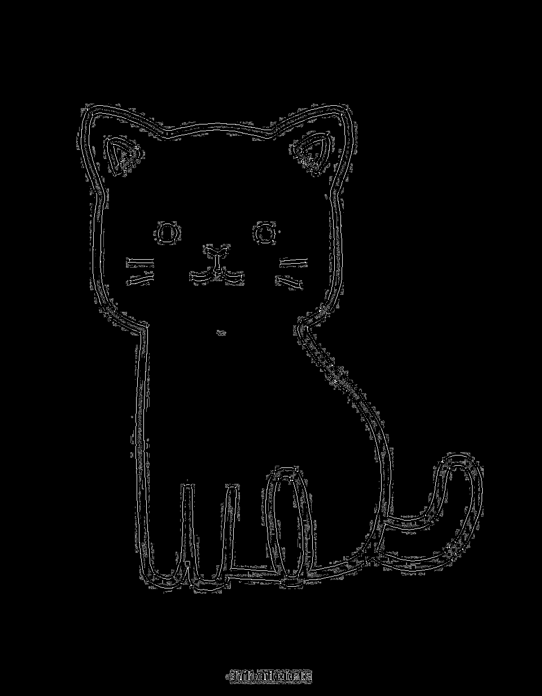
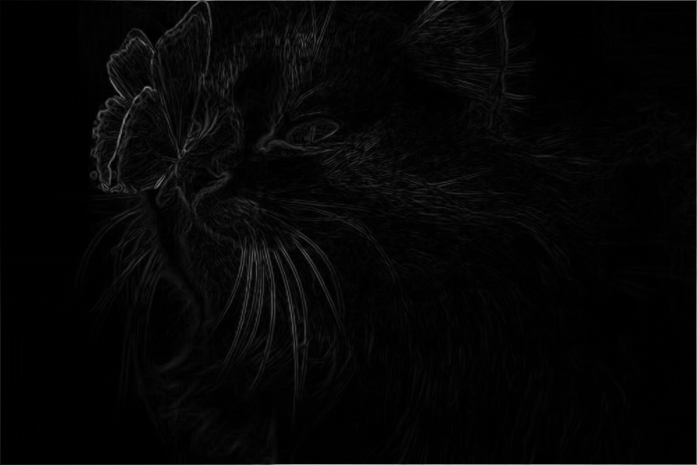
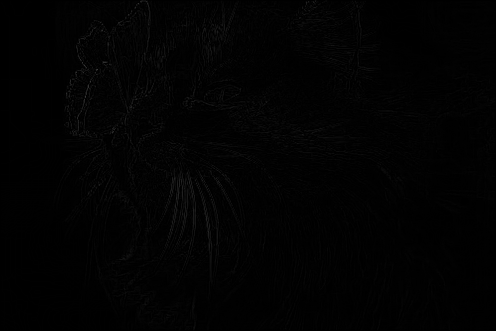
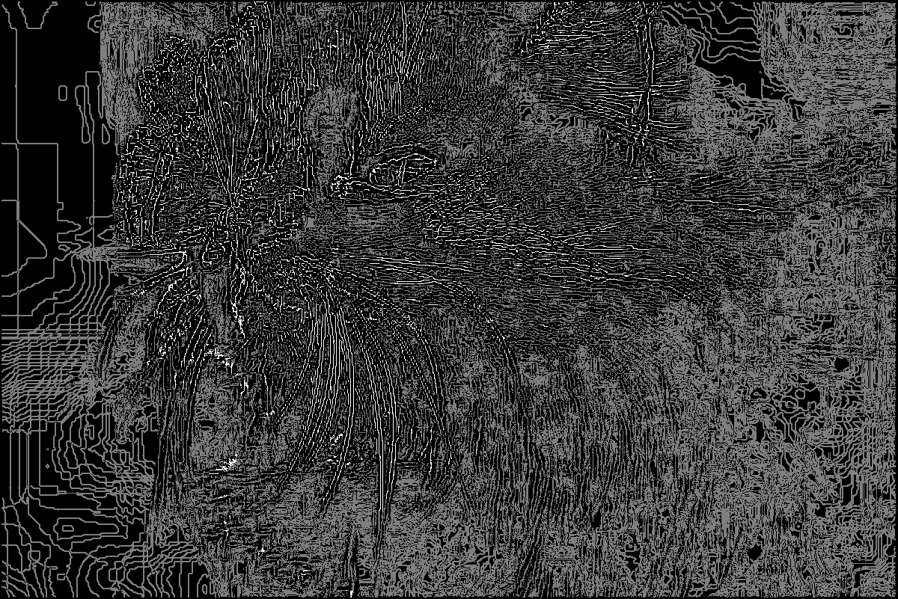
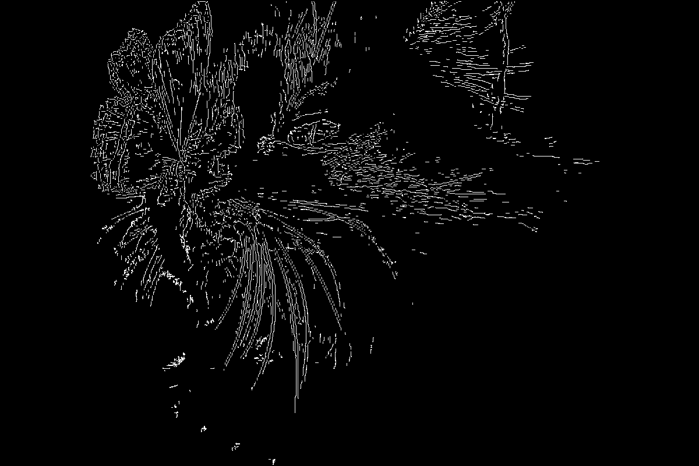

# Canny-Edge-Detector

A script (so far) that detects the major edges in an image! This will eventually turn into a webtool that (hopefully) anyone would be able to use with more functionality than just edge detection. I am currently looking into Harris Corner detection, image sharpening, and other computer vision algorithms I am currently learning and looking to learn.

# Demo work:
Featuring some images I've processed and visible evidence of the script doing something. There are 5 steps to the process:
- Blurring image to reduce noise
- Gradient intensities of image (looks the coolest in my opinion)
- Non-maximum suppression to thin edges
- Double threshold to classify edge significance
- Hysteresis to finally determine major edges

2 demos:

[Simple Cat](#simple-cat)

[Cat](#cat)

## Simple Cat
### Input

### Blurred

### Gradient Intensity

### Non-Maximum Suppression

### Double Threshold

### Hysteris (Final)

## Cat
### Input

### Blurred

### Gradient Intensity

### Non-Maximum Suppression

### Double Threshold

### Hysteris (Final)

